  

  

<h1 align="center">Damir Lutfrakhmanov</h1>

  FullStack Engineer • Realtime Systems • Game Backend Architecture

  <a href="https://damirlut.dev">Portfolio ↗</a>

---

## About

- Building realtime multiplayer systems, backend infrastructure and developer tooling
- Developing fullstack applications for VK Mini Apps and Telegram Mini Apps
- Focused on TypeScript, Bun, Go, React and high-performance networking
- Interested in game architecture, rendering pipelines and distributed systems

---

## Core Stack

### Languages

### Backend

### Frontend

### DevOps

---

## Current Focus

- Realtime multiplayer infrastructure
- Bun-native backend systems
- WebSocket architecture & scaling
- GameMaker + Haxe tooling
- Rendering pipelines & performance optimization
- VK Mini Apps & Telegram Mini Apps ecosystems

## Interests

- Multiplayer game servers
- Rendering pipelines
- WebSockets & realtime networking
- Game tooling & editor tooling
- Distributed systems
- Reverse engineering
- Developer experience

---

## GitHub Stats

 
  

